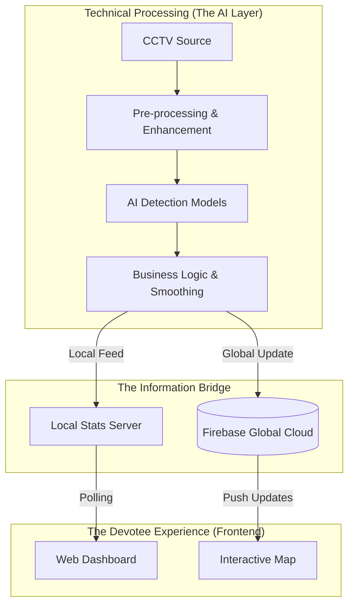

# Descriptive Architecture: Smart Temple Management System

This document provides a comprehensive, narrative explanation of how the Smart Temple Management System functions, from the moment a camera captures a frame to the final update on a devotee's smartphone.

---

## 1. System Overview
The system is built as a **distributed edge-AI network**. It doesn't rely on a single central server for processing; instead, individual "Worker" modules (Python scripts) sit close to the cameras at the temple. These workers process video data locally and only send "meaningful numbers" (like the count of available parking spots or queue wait times) to the cloud. This ensures the system is fast, respects privacy, and works even with limited internet bandwidth.

---

## 2. Visual Architecture (The Logical Flow)

---

## 3. Core Algorithms Used
This system uses several mathematical and neural network models to convert raw video into temple statistics:

*   **YOLOv8 / YOLO11 (Real-time Object Detection):** The "eye" of the system. It uses deep learning to identify cars, buses, and people in milliseconds by scanning the frame for learned features.
*   **Ultralytics ObjectCounter (Crossing Logic):** A tracking algorithm that assigns unique IDs to objects and detects when their movement vector crosses a predefined virtual line in the entry gate.
*   **Moving Average Smoothing:** A statistical algorithm used to filter out noise. By averaging detections over the last 8 frames, it prevents "flicker" and ensures the UI status (Available vs Full) is stable.
*   **Wait-Time Estimation Model:** A linear predictive logic that calculates: `(Current Crowd Count / Entry Flow Rate)`. This translates raw numbers into "Minutes of Wait" for the user.

---

## 4. Essential Pre-processing Steps
Before the AI processes any frame, it undergoes several "cleanup" steps to ensure accuracy:

*   **CLAHE Enhancement (Contrast Equalization):** A pre-processing step that balances brightness and contrast. This allows the AI to "see" cars in deep shadows or people during bright midday sun by equalizing the histogram of the image.
*   **ROI Masking (Region of Interest):** A digital "stencil" applied to the video. It blocks out irrelevant areas like moving trees, busy roads, or crowds outside the parking area, focusing the AI only on valid spots.
*   **Bitwise Image Operations:** Used to merge the masks with live video frames at lightning speed before detection begins.
*   **Frame Decimation (Processing Rate Control):** To stay real-time, the system only processes 1 frame out of every 10. This prevents "processing backlog" and ensures the data reflects the absolute latest state of the temple.

---

## 5. The Lifecycle of Data (Descriptive Walkthrough)

### Step 1: Vision and Enhancement
The process begins at the **CCTV Camera Lens**. Raw video is often noisy. Before the AI even looks at the image, we apply **CLAHE**. This is like "digital sunglasses" that balances the light and dark parts of the frame, making hidden details visible. We then apply the **ROI Mask** to ignore foreground noise.

### Step 2: Intelligent Detection
Once the image is clean, it enters the **YOLO Engine**. It scans for specific labels (Cars for parking, Persons for queues). The **ObjectCounter** then handles the logic for counting people entering through the gates.

### Step 3: Stability and Logic
To prevent the user's dashboard from "flickering" between statuses, we use the **Moving Average Buffer**. This ensures that the status only changes when there is a real, sustained change in the crowd.

### Step 4: The Cloud Sync
The processed numbers are sent to the **Firebase Realtime Database**. As soon as a number changes, Firebase pushes that change to every map or dashboard instantly.

---

## 6. Key Technical Components

| Component | Responsibility | Technical Stack |
| :--- | :--- | :--- |
| **Worker AI** | Real-time counting and detection | Python, YOLOv8, OpenCV |
| **Data Bridge** | Global real-time synchronization | Firebase Realtime DB |
| **Live API** | Serving crowd stats locally | FastAPI, Uvicorn |
| **Companion Web** | User-facing dashboard and maps | HTML5, CSS3, Vanilla JS, Leaflet |
